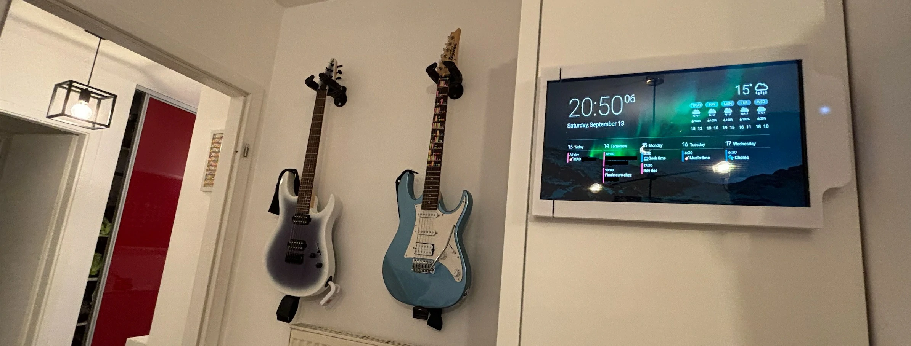
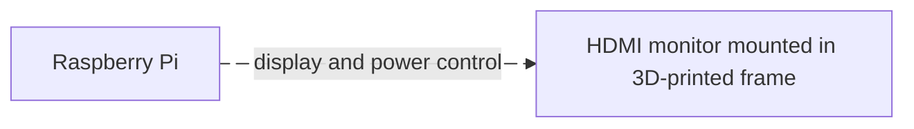

  <h3 align="center">Home Google Calendar Dashboard</h3>
  

	Build your own Google calendar-synced dashboard using simple parts.
  

  

    
  

## Hardware requirements
- A Raspberry Pi 3B+ (not tested on other models).
- A small HDMI monitor (e.g. 10.5inch).  
- 90° angle connectors for HDMI monitor cables. This helps cables going through the wall.
- Access to a 3D printer to print the frame.

## Software requirements
- A Google account.
- A [DAKboard](https://dakboard.com/site) account.
- [Raspberry Pi imager](https://www.raspberrypi.com/software) software.
- 3D-modelling software if you need to adapt the frame geometry to your own monitor.

## Step-by-step guide
🚧 Under construction 🚧